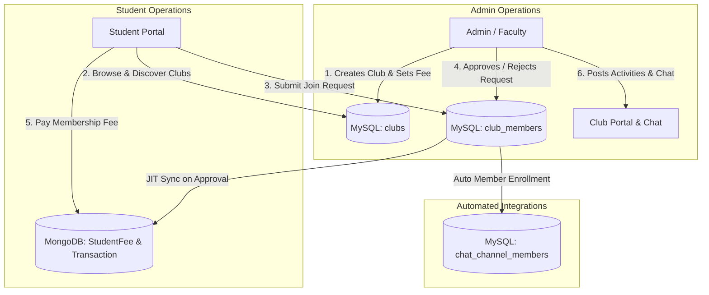
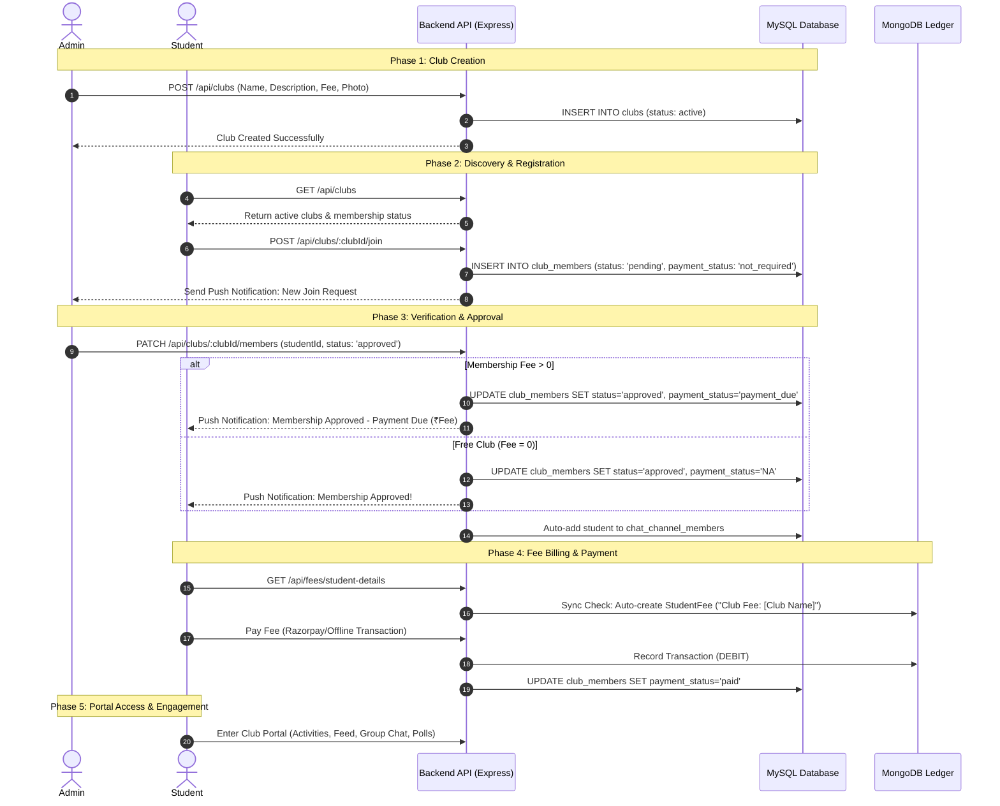

# Comprehensive Documentation: Club Management System & Workflow

---

## 1. Executive Summary

The **Club Management System** within the Student Data Management Application provides an end-to-end ecosystem for managing student clubs, communities, and departmental organizations. It seamlessly handles club creation, student discovery, join request approvals, automated fee integration, activity feeds, and real-time member communication channels.

---

## 2. System Architecture & Database Structure

The system operates on a **hybrid database model**, combining **MySQL** (for core entity relationships, metadata, and communication channels) with **MongoDB** (for dynamic fee billing and transaction accounting).

### Database Tables & Models

#### A. MySQL Database (Relational Core)
1. **`clubs`**: Core repository for club profiles.
   - `id`: Auto-increment Primary Key.
   - `name`: Club name (e.g., *Coding Club*, *Cultural Club*).
   - `description`: Overview and mission statement.
   - `image_url`: Cover image stored as Base64 data URI or HTTP URL.
   - `membership_fee`: Numeric fee amount (e.g., `500.00`). Default `0`.
   - `fee_type`: Frequency billing model (`Yearly` or `Semesterly`).
   - `is_active`: Boolean flag toggling club availability (`TRUE` / `FALSE`).
   - `activities`: JSON array storing posted events and announcements.
   - `created_by`: Foreign key to user ID of creator (Admin/Faculty).
   - `created_at`: Timestamp.

2. **`club_members`**: Tracks student memberships & lifecycle status.
   - `id`: Primary Key.
   - `club_id`: Foreign Key to `clubs.id`.
   - `student_id`: Foreign Key to `students.id`.
   - `status`: Lifecycle state (`pending` | `approved` | `rejected`).
   - `payment_status`: Fee status (`not_required` | `payment_due` | `paid` | `NA`).
   - `fee_type`: Inherited fee frequency from club configuration.
   - `joined_at` / `updated_at`: Timestamps.

3. **`chat_channels` & `chat_channel_members`**: Group communication channels tied to clubs.
   - `channel_type`: Set to `'club'`.
   - `club_id`: Links chat channel directly to `clubs.id`.
   - Members are auto-enrolled upon membership approval.

#### B. MongoDB Collections (Fee Engine)
1. **`FeeHead`**: Pre-configured global head with code `CF` (*Club Fee*).
2. **`StudentFee`**: Specific fee ledger item per student. Unique compound index `{ studentId, feeHead, remarks }` prevents double charging.
3. **`Transaction`**: Records actual student payments (DEBIT entries) against the generated `StudentFee`.

---

## 3. End-to-End Workflow & Life Cycle

---

## 4. Detailed Feature Breakdown

### A. Club Creation & Management (Admin Side)

1. **Club Provisioning**:
   - Admins/Faculty navigate to `Clubs & Communities` in the Admin Dashboard.
   - Click **"Create New Club"** to open the setup form.
   - Enter details:
     - **Name**: Official name of the club.
     - **Description**: Detailed overview and objectives.
     - **Cover/Profile Image**: File upload processed via Base64/Multer.
     - **Membership Fee**: ₹ amount (e.g., `₹500` or `₹0` for free clubs).
     - **Fee Frequency**: `Yearly` or `Semesterly`.
   - Submitting sends a `POST /api/clubs` request with `multipart/form-data`.

2. **Club Status Controls**:
   - **Activation Toggle**: Admins can temporarily set `is_active = FALSE` to hide a club from student discovery without deleting data.
   - **Edit & Update**: Admins can adjust fee structures, titles, descriptions, and cover photos anytime.
   - **Delete Club**: Hard deletion removes the club record from MySQL.

---

### B. Student Discovery & Registration Process

1. **Browsing & Discovery**:
   - Students visit **My Clubs** in the Student Portal.
   - View tabs:
     - **My Territories**: Lists clubs the student has requested, pending approval, or actively joined.
     - **Discover All**: Browses all available active clubs with search filters.
   - Each card displays:
     - Cover image, name, member count, description.
     - Fee badge (e.g., `₹500/Year` or `Free`).
     - Status badges (`Active`, `Waiting Approval`, `Settlement Required`, `Entry Restricted`).

2. **Submitting a Registration**:
   - Student clicks **"Request Access"** on a club card.
   - Frontend calls `POST /api/clubs/:clubId/join`.
   - System validates if student has already registered.
   - Creates a record in `club_members` with `status = 'pending'`.
   - Sends a real-time web push notification to the club admin.

---

### C. Verification & Approval Lifecycle

1. **Admin Review Interface**:
   - Admin opens the target club details and switches to the **"Requests"** tab.
   - Displays all pending applicants with student profile cards (Admission Number, Name, Branch, Year, Semester).

2. **Decision Execution**:
   - **Rejection (`status = 'rejected'`)**:
     - `club_members.status` updated to `'rejected'`. `payment_status` set to `'NA'`.
     - Student gets notification: *"Your request to join [Club Name] was not approved."*
   - **Approval (`status = 'approved'`)**:
     - **If Fee > 0**: `payment_status` set to `'payment_due'`. Student receives notification *"Club Membership Approved - Please pay ₹[Amount] to complete joining."*
     - **If Fee = 0**: `payment_status` set to `'NA'`. Immediate full access granted.
     - **Chat Room Assignment**: System executes `INSERT IGNORE INTO chat_channel_members` to automatically add student to the club's chat room.

---

### D. Automated Fee Integration (SQL to MongoDB Bridge)

To eliminate manual fee entries by accounting staff, the application uses **Just-In-Time (JIT) Fee Sync**:

1. **JIT Trigger**:
   - When an admin views the student's **Fee Collection** page or student opens **Fee Management**, `getStudentFeeDetails` executes.
2. **Query Verification**:
   - Backend queries MySQL `club_members` for `status = 'approved'`.
3. **MongoDB Document Provisioning**:
   - Finds generic `FeeHead` with code `CF` (*Club Fee*).
   - Checks if a `StudentFee` entry already exists for `{ studentId, feeHead: CF, remarks: "Club Fee: [Club Name]" }`.
   - If missing, auto-inserts a `StudentFee` ledger entry for `clubs.membership_fee`.
4. **Payment Reconciliation**:
   - When payment is processed, MongoDB records a `Transaction`.
   - During list fetching, backend checks paid transactions matching `"Club Fee: [Club Name]"` in remarks and automatically syncs `club_members.payment_status = 'paid'`.

---

### E. Club Portal & Member Engagement Features

Once approved (and fee paid if required), the student unlocks the **Club Portal**:

| Feature Tab | Capability | User Roles |
| :--- | :--- | :--- |
| **About / Overview** | Club mission, guidelines, header graphics, membership tier details. | All Members & Admins |
| **Activities Feed** | Event notices, activity logs with images, posted by admins. Members get push notifications for new activities. | All Members & Admins |
| **Club Communication (Chat)** | Real-time chat room with text, image attachments (up to 20KB), interactive polls, message editing/deletion, and automated deletion schedules. | Approved & Paid Members + Admins |
| **Admin Settings** | Restrict student message sending (read-only announcements mode), auto-delete timer configurations (7, 10, 30 days). | Admins Only |

---

## 5. Security & Access Control Summary

1. **Role-Based Routing (RBAC)**:
   - Creation, deletion, member approval/rejection, activity posting, and channel settings are restricted to `admin` and `super_admin` roles via `requireAdmin` middleware.
2. **Payment Gatekeeping**:
   - If `membership_fee > 0` and `payment_status === 'payment_due'`, the frontend blocks entrance to the Club Portal and Chat tab, prompting the student to settle fee dues first.
3. **Channel Privacy**:
   - Non-members or unapproved applicants cannot fetch chat channels or participate in club discussions.
